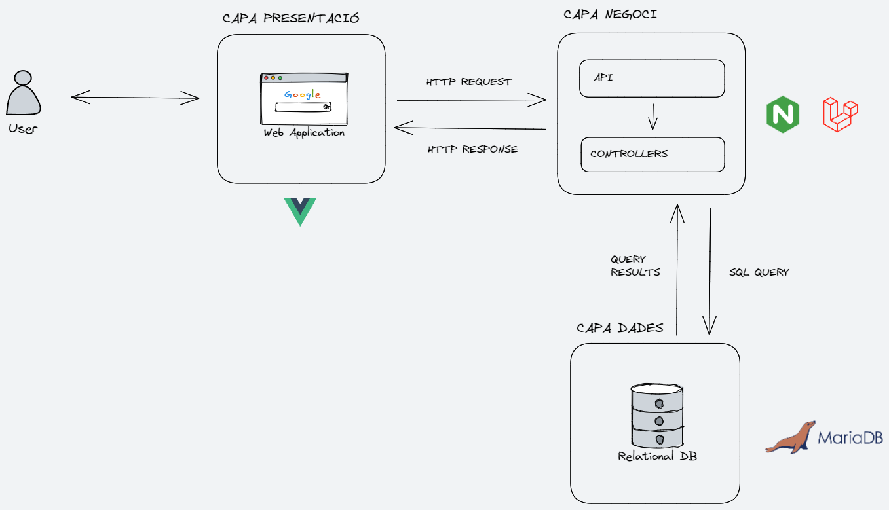

# Index
- [Index](#index)
  - [Instruccions](#instruccions)
  - [URLs](#urls)
  - [Diagrama backend](#diagrama-backend)

&nbsp;

## Instruccions

Les comandes que apareixen a continuació s'han d'executar a l'arrel d'aquest projecte, és a dir, on es troba el nostre **[docker-compose.yml](docker-compose.yml)**.

En primer lloc, arrancarem els contenidors
```
docker compose up -d
```

Crear l'arxiu **.env** a l'arrel de la carpeta **backend** a partir de **.env.example**.

El **.env.example** ja porta les credencials d'accés a la BBDD per simplificar la tasca.

Un cop tenim l'arxiu **.env** creat, necessitarem descarregar les dependències de Laravel
```
docker compose run --rm php composer install
```

Crearem la BBDD
```
docker compose run --rm php php artisan migrate --seed
```

Instal·larem les dependències de Vue
```
docker compose run --rm node npm i
```

Finalment, arrancarem el contenidor de node en concret
```
docker compose up node -d
```

&nbsp;

## URLs
Tenim accés a les següents urls:
- [Vue (localhost:80)](http://localhost/customers/1)
- [Laravel (localhost:8000)](http://localhost:8000)
- [phpmyadmin (localhost:8080)](http://localhost:8080)

&nbsp;

## Diagrama backend

[Excalidraw file](diagram.excalidraw)
